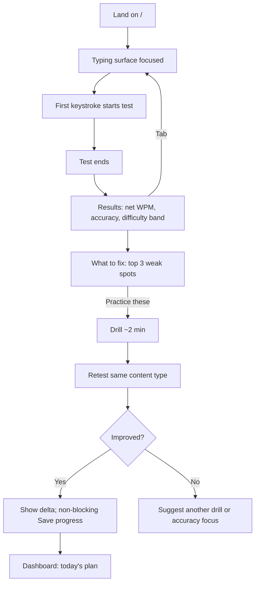
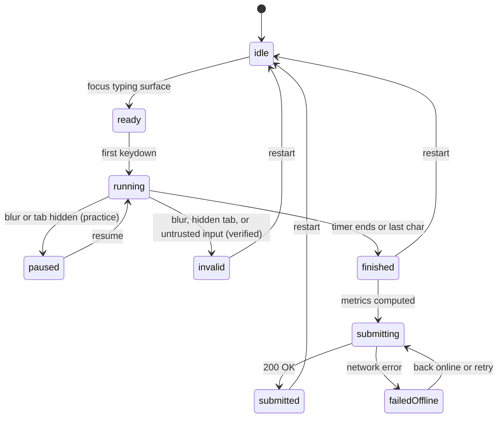
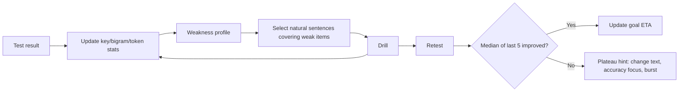
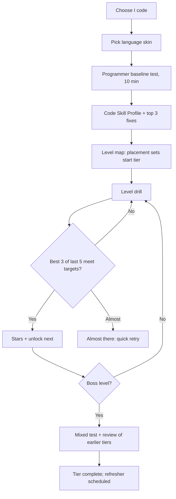
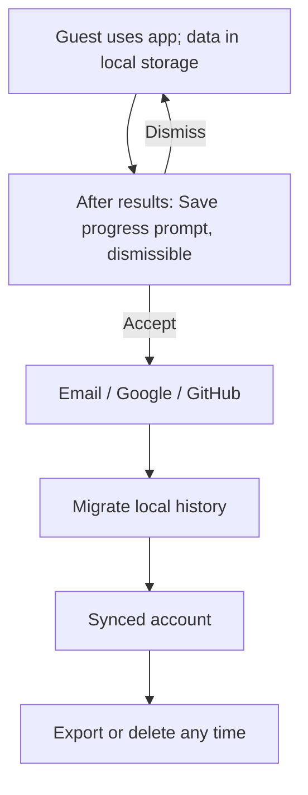
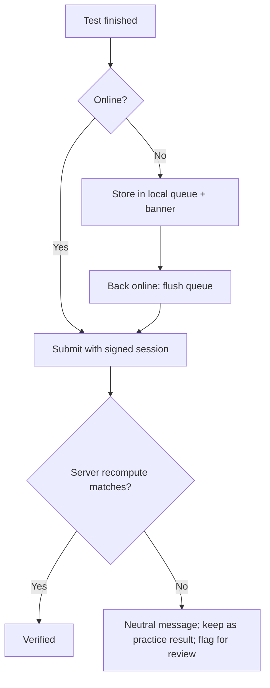

# OpenCode Build Playbook — Skills, Animation, UI/UX, Flows and Actions

**Date:** 20 Sep 2026
**For:** building the RealType typing website (see `typing-website-master-spec-v1.md`) with **OpenCode**
**Ships with:** `realtype-opencode-starter-kit.zip` (10 project skills, 4 subagents, 7 commands, AGENTS.md, safe config)

**How to read this:** ✓✓ multiple sources · ✓ one credible source · **[inference]** my reasoning, not a sourced fact · **[proposal]** a starting value to tune.

**Contents**
1. TL;DR
2. How OpenCode skills work (verified)
3. Skill supply-chain security (read before installing anything)
4. Third-party skills to add
5. Project skills to write (already in the kit)
6. OpenCode setup: agents, commands, MCP, permissions
7. Animation, UI and UX research → design decisions
8. User flows
9. Action catalog
10. Screen → component → motion map
11. Build plan in OpenCode (milestones and prompts)
12. Install checklist (must / should / optional)
13. Caveats and unknowns
14. Sources

---

## 1. TL;DR

- I read this as: **"skills" = OpenCode Agent Skills** (`SKILL.md` folders the agent loads on demand). I also covered subagents, commands and MCP, because they work together. *Tell me if you meant something else.*
- **Three layers of skills:**
  1. **Third-party skills** for general craft: UI taste, animation, React performance, accessibility, testing, MongoDB.
  2. **Project skills** that encode *our* rules (typing engine, metrics, caret rendering, motion tokens, privacy, anti-cheat). No public skill can know these, so I wrote them.
  3. **Config** (permissions, MCP, subagents, commands) that make the skills safe and cheap to use.
- **Keep the installed set lean.** OpenCode lists every skill's name and description in the `skill` tool description, so each installed skill costs context **[inference]**. MCP servers add context too, and OpenCode warns about this explicitly. `[OC-MCP]`
- **Security is not optional.** Studies of skill marketplaces report high rates of flawed or malicious skills, and skills with scripts are riskier. Vet everything, default third-party skills to `ask`. (§3)
- **Motion rule that shapes everything:** the typing surface gets *no decorative motion*; only the caret moves, and only via `transform`. Everything else can animate within a budget. (§7)

---

## 2. How OpenCode Skills Work (Verified on 19–20 Sep 2026)

Source: official docs `[OC-Skills]`, last updated 19 Sep 2026.

**Where skills live** (OpenCode walks up from your working directory to the git root):
- Project: `.opencode/skills/<name>/SKILL.md`, `.claude/skills/<name>/SKILL.md`, `.agents/skills/<name>/SKILL.md`
- Global: `~/.config/opencode/skills/`, `~/.claude/skills/`, `~/.agents/skills/`

**Frontmatter** (only these are recognized; unknown fields are ignored): `name` (required), `description` (required), `license`, `compatibility`, `metadata` (string map).
- `name`: 1–64 chars, lowercase alphanumerics with single hyphens, must match the folder name (regex `^[a-z0-9]+(-[a-z0-9]+)*$`).
- `description`: 1–1024 chars. Make it specific so the agent picks the right skill.

**Loading:** skills are loaded on demand through the native `skill` tool. The tool description lists available skills (name + description); the agent calls `skill({ name: "…" })` to load full content.

**Permissions** (`opencode.json`):
```json
{ "permission": { "skill": { "*": "ask", "typing-*": "allow", "internal-*": "deny" } } }
```
`allow` loads immediately, `deny` hides the skill, `ask` prompts you. Patterns support wildcards. You can override per agent (in agent frontmatter or `agent.<name>.permission.skill`) and disable the skill tool for an agent (`tools: { skill: false }`).

**Related config**
- `AGENTS.md` at repo root = project rules; `/init` creates or improves it in place. Global rules: `~/.config/opencode/AGENTS.md`. Claude Code files (`CLAUDE.md`, `.claude/skills`) work as fallbacks. `[OC-Rules]`
- Subagents: `.opencode/agents/<name>.md` (frontmatter: `description`, `mode`, `model`, `temperature`, `permission`). Built-ins: Build and Plan (primary); General, Explore, Scout (subagents). Invoke with `@name`. `[OC-Agents]`
- Commands: `.opencode/commands/<name>.md`, with `$ARGUMENTS`, `!` shell injection, `@file` references, and `agent`/`subtask`/`model` options. `[OC-Commands]`
- MCP: `mcp` block in config (local or remote, OAuth supported). Context7 is a documented example. `[OC-MCP]`

**Version note:** OpenCode v2 docs exist (`opencode.ai/v2/docs`). They describe path-derived skill IDs, optional frontmatter, and a `permissions` **array** format instead of the object format above. `[OC-Skills-v2]` The kit uses the current v1 docs format. If you're on v2, translate the permission block and check the ID rules.

**Installing third-party skills:** the Vercel `skills` CLI supports OpenCode (`-a opencode`): `npx skills add <owner/repo> --list`, `--skill <name>`, `find`, `update`, `init`. `[Skills-CLI]` GitHub's `gh skill install` also lists OpenCode as a supported agent. `[gh-skill]`

**Restart tip [inference]:** an older OpenCode skills plugin discovered skills at startup and needed a restart after changes. Native behavior isn't documented on the page I read; restart OpenCode after adding skills to be safe.

---

## 3. Skill Supply-Chain Security (Read Before Installing)

**What's reported**
- A Snyk audit ("ToxicSkills") of ~4,000 marketplace skills reported roughly a third with security flaws, ~13% with critical issues, and dozens confirmed malicious; a separate campaign dropped 341 malicious skills into one marketplace within days. `[Skill-Sec]`
- NVIDIA's SkillSpector README cites a 2026 study of ~31k skills: ~26% had at least one vulnerability, ~5% showed likely malicious intent, and **skills with executable scripts were ~2.1× more likely to be vulnerable**. `[SkillSpector]`
- A skill doesn't need code to be dangerous: instructions alone can steer an agent to exfiltrate data. `[Skill-Sec]`
- Repository-controlled config can also be an attack path (a disclosed Claude Code issue let a malicious repo run hooks on open; fixed in Jan 2026). Treat *any* cloned repo's agent config as untrusted. `[CSA-Note]`

*(These numbers come from scanner/security vendors and research summaries; treat them as directional.)*

**Our policy**
1. **Allowlist sources:** official orgs and widely used maintainers first (Anthropic, Vercel Labs, MongoDB, Microsoft, GreenSock, Emil Kowalski, Addy Osmani). Everything else = extra scrutiny.
2. **`--list` first, then read `SKILL.md` fully.** Look for instructions to send data, download/execute things, disable safety, or "ignore previous instructions."
3. **Prefer skills with no scripts.** If scripts exist, read every one.
4. **Scan** with a tool such as NVIDIA SkillSpector before installing. `[SkillSpector]`
5. **Pin** to a commit/tag when possible; re-vet on update (`npx skills update` is a trust event).
6. **Permission `ask`** for new third-party skills in `opencode.jsonc`; promote to `allow` after use.
7. **No secrets in the environment** while trying new skills; use a throwaway shell/container.
8. **Cap the count** (~15–20 installed) to limit both risk and context cost.

---

## 4. Third-Party Skills to Add

**Priority:** **Must** = install for MVP · **Should** = install when you reach that area · **Optional** = only if you need it.
Names inside repos can change. Trust `npx skills add <repo> --list` over this table.

### 4.1 UI craft and design taste
| Skill | Source | Why | Priority |
|---|---|---|---|
| `frontend-design` | `anthropics/skills` | Official guidance for distinctive, non-generic UI: typography, color, motion | **Must** |
| `web-design-guidelines` | `vercel-labs/agent-skills` | Reviews UI code against 100+ rules (accessibility, performance, UX) | **Must** |
| `emil-design-eng` + `review-animations` | `emilkowalski/skills` | Animation decisions (should it animate? which easing?) and a strict animation review pass | **Must** |
| `theme-factory` | `anthropics/skills` | Palettes/type pairs to seed themes | Optional |
| Taste-style skills (e.g., `taste-skill`, `ui-ux-pro-max`) | community | Anti-generic-UI guidance; very popular but unvetted here | Optional (pick ≤ 1) |

*Rule:* use **one** primary design skill (`frontend-design`) plus Emil's for motion. Our `typing-design-tokens` skill is the authority when advice conflicts. Stacking many design skills gives conflicting guidance and wastes context **[inference]**.

### 4.2 Animation and motion
| Skill | Source | Why | Priority |
|---|---|---|---|
| Emil skills (above) | `emilkowalski/skills` | Restraint + speed philosophy; ties to his course; installs via `npx skills@latest add emilkowalski/skills` | **Must** |
| `design-motion-principles` | `kylezantos/design-motion-principles` | Build/audit modes using three designers' lenses (restraint, polish, playfulness) | Optional |
| `motion-design` | `LottieFiles/motion-design-skill` | Philosophy-first: timing, easing, choreography, reduced-motion context; implementation-agnostic | Optional |
| `micro-interactions` | `solinkz/micro-interactions-skill` | Saffer's Trigger → Rules → Feedback → Loops framework; 10-dimension audit; explicit OpenCode install flag | Optional |
| GSAP skills | `greensock/gsap-skills` | Official GSAP guidance (timelines, ScrollTrigger, React); GSAP and its plugins are now free | Only if you adopt GSAP for marketing pages |
| `60fps-animation`, `gsap-web` | `iart-ai/web-animation-skills` | Transform/opacity-only performance rules | Optional |

### 4.3 React, performance, and web quality
| Skill | Source | Why | Priority |
|---|---|---|---|
| `vercel-react-best-practices` | `vercel-labs/agent-skills` | 40+ prioritized rules (waterfalls, bundle size, re-renders, rendering) | **Must** |
| `vercel-composition-patterns` | `vercel-labs/agent-skills` | Component composition patterns | Should |
| Web quality skills (performance, Core Web Vitals, accessibility) | `addyosmani/web-quality-skills` | Lighthouse-driven audits | Should |

### 4.4 Accessibility
| Skill | Source | Why | Priority |
|---|---|---|---|
| AccessLint skills | `AccessLint/skills` | WCAG 2.2 audit workflow: scan, keyboard/screen-reader checks, remediation, regression diff | **Should** |
| a11y audit skills (community) | various | Similar; vet first | Optional |

### 4.5 Testing and QA
| Item | Source | Why | Priority |
|---|---|---|---|
| `webapp-testing` | `anthropics/skills` | Playwright-driven UI verification | **Should** |
| Playwright CLI + skills or Playwright MCP | `microsoft/playwright-mcp` | Microsoft's README says CLI + skills are more token-efficient for coding agents; MCP returns an accessibility-tree snapshot | **Should** |
| Playwright best-practices skill | Currents (vendor) | Locator strategy, web-first assertions, flake handling | Optional (vendor-run) |
| Superpowers (TDD, review workflow) | `obra/superpowers` (listed in community lists) | Process discipline | Optional; vet |

### 4.6 Data and backend
| Skill | Source | Why | Priority |
|---|---|---|---|
| MongoDB skills: schema design, connection, query optimizer, natural-language querying | `mongodb/agent-skills` | Official schema-design rules (embed vs reference, patterns like bucket/computed), connection tuning, index advice | **Should** |
| Node/Express security | *no verified official skill found* | Covered by our `security-auditor` subagent + `integrity-anti-cheat` and `keystroke-privacy` | Custom |

### 4.7 Docs, tools, and meta
| Item | Source | Why | Priority |
|---|---|---|---|
| **Context7 MCP** | `mcp.context7.com/mcp` | Up-to-date library docs in the prompt; documented in OpenCode's MCP page | **Must** |
| `skill-creator` | `anthropics/skills` | Write/improve project skills | Should |
| `find-skills` | `vercel-labs/skills` | Let the agent discover skills (still vet) | Optional |

### 4.8 Install commands
```bash
# Always list first and read what you're installing
npx skills add <owner/repo> --list

npx skills add anthropics/skills --skill frontend-design --skill webapp-testing --skill skill-creator -a opencode
npx skills add vercel-labs/agent-skills --skill web-design-guidelines --skill vercel-react-best-practices --skill vercel-composition-patterns -a opencode
npx skills add emilkowalski/skills -a opencode
npx skills add addyosmani/web-quality-skills -a opencode
npx skills add AccessLint/skills -a opencode
npx skills add mongodb/agent-skills -a opencode
# optional motion/UX (pick one or two)
npx skills add kylezantos/design-motion-principles -a opencode
npx skills add LottieFiles/motion-design-skill -a opencode
npx skills add solinkz/micro-interactions-skill --agent opencode
```

---

## 5. Project Skills to Write (Already in the Kit)

No public skill knows our typing-specific rules, so these encode them. All 10 pass OpenCode's name/description validation rules.

| Skill | What it enforces | Spec IDs |
|---|---|---|
| `typing-engine-core` | Pure TS engine; keydown/keyup timestamps; no per-keystroke React state; state machine; hidden-tab safety; layout-aware input | ENG-01…13 |
| `typing-metrics-spec` | Exact WPM/net/accuracy/KSPC/rollover formulas, test vectors, versioning; difficulty bands (no multiplier yet) | §6 |
| `typing-caret-rendering` | Visible-window rendering, transform-only caret, cached offsets, non-color cues, code-mode rules | ENG-02, PRG-15 |
| `typing-design-tokens` | CSS-variable tokens, themes, contrast, component inventory and states, UX writing | CUS-02, A11Y-01 |
| `typing-motion-tokens` | Duration/easing tokens, the "no motion on the typing surface" rule, reduced-motion policy, microinteraction catalog | CUS-01, A11Y-01 |
| `a11y-typing-ui` | Typing-specific accessibility (announce results not keystrokes, no-timer mode, targets ≥ 24 px, table alternatives) | A11Y-01…06 |
| `token-drill-generators` | Seeded, token-tagged, synthetic-only generators for programmer levels 1–30; licensing/safety | PRG-01…18 |
| `integrity-anti-cheat` | Signed sessions, server recompute, plausibility checks; no public leaderboards before integrity layers | INT-01…10 |
| `keystroke-privacy` | No typed content in analytics/errors; retention, consent, export/delete | USR-04, NFR-09 |
| `typing-e2e-testing` | Playwright patterns, deterministic seeds, latency harness, a11y and reduced-motion matrices | NFR-01, NFR-12 |

**Later skills to add as you reach them:** `content-licensing` (license register rules), `analytics-events` (event allowlist), `release-checklist` (Definition of Done), `programmer-baseline-test`, `leaderboard-and-races` (V1).

---

## 6. OpenCode Setup: Agents, Commands, MCP, Permissions

**Subagents in the kit** (all read-only; outputs are findings tables):
| Agent | Use |
|---|---|
| `ui-reviewer` | Tokens, motion, caret/rendering, a11y review of UI code |
| `a11y-auditor` | WCAG 2.2 audit with "verified in code" vs "needs manual check" |
| `security-auditor` | XSS in snippets, session/result integrity, typed-content leaks, secrets, license risks |
| `spec-checker` | Compares code to requirement IDs; lists missing tests |

**Commands in the kit:** `/spec-check <IDs>` · `/anim-audit <path>` · `/a11y <target>` · `/perf` · `/flow <name>` · `/new-component <Name>` · `/drill <tier>`

**Config highlights (`opencode.jsonc`)**
- `permission.skill`: `"*": "ask"`, project skills `allow` (last matching rule wins).
- `permission.bash`: `"*": "ask"` with `pnpm *` and read-only git commands allowed.
- MCP: Context7 on; Playwright MCP **off** until needed (context cost).
- Plan agent: edit/bash = `ask`.

**Working pattern**
1. **Plan agent** (Tab) for anything spanning > 3 files; **Build agent** for small tested slices.
2. Each task cites a requirement ID; load the relevant project skills first.
3. Run `/spec-check`, `/anim-audit`, `/a11y` before merging.
4. Keep the spec **out of** `instructions`; let agents read sections on demand (OpenCode documents lazy loading via explicit read instructions). `[OC-Rules]`

---

## 7. Animation, UI and UX Research → Design Decisions

**Honest scope note:** I found no rigorous UX research specific to typing trainers. The guidance below combines (a) general HCI/animation/accessibility sources, (b) motion library docs, and (c) the competitor-review complaints from the earlier audit. Validate with a 5-person usability test in R0/R1.

### 7.1 Timing: the perceptual limits
Nielsen's limits `[NNg-Response]`:
- **≈ 0.1 s** feels instantaneous: the user feels they are directly manipulating the UI.
- **≈ 1 s** keeps the flow of thought uninterrupted (delay noticed, no special feedback needed).
- **≈ 10 s** is the limit for holding attention; beyond it, show progress.

**Design consequences**
- Keystroke feedback is direct manipulation: it must land far inside 0.1 s. Our engineering target (16 ms p95) is a **[proposal]** for smoothness, well below the 0.1 s limit.
- Navigation and results should appear within ~1 s; show a skeleton after that.
- Anything that can take > 10 s (none in MVP) gets progress + cancel.

### 7.2 Where motion belongs
| Zone | Motion allowed | Why |
|---|---|---|
| **Typing surface** | Caret `transform` only; instant color/underline state | Direct manipulation; no latency budget for decoration |
| Live stats | Instant number updates (no count-up while typing) | Don't distract |
| Results | Fade + small rise, 30 ms stagger; graph draw-on | Rewards attention *after* the test |
| Level map / dashboard | Unlock, star, streak ticks (once, skippable) | Motivation without nagging |
| Navigation | ≤ 200 ms fade/slide | Orientation |
| Settings | Instant | Utility |
| Marketing pages | Richer scroll/hero motion, lazy-loaded | Not in the typing path |

### 7.3 Technology choices
| Need | Use | Facts / reasons |
|---|---|---|
| Hover, focus, press, simple fades | **CSS transitions** with tokens | No JS; compositor-friendly **[inference]** |
| Mount/unmount, layout, shared elements, stagger, gestures | **Motion for React** with `m` + `LazyMotion` | `motion` can't tree-shake below ~29–34 kB; `m` + `LazyMotion` gets the initial render to ~4.6 kB `[Motion-Bundle]` |
| Small imperative sequences | Motion `useAnimate` (mini) | ~2.3 kB, uses the Web Animations API (hardware accelerated); hybrid ~17 kB `[Motion-Bundle]` |
| Per-frame/per-keystroke values (caret, progress) | Motion values, refs, CSS variables | Motion values update styles **without re-rendering React** `[Motion-LLMs]` |
| Reduced motion | `MotionConfig` + CSS media query + in-app toggle | `MotionConfig` manages reduced-motion preferences `[Motion-LLMs]` |
| Landing hero / scroll storytelling | GSAP (lazy-loaded, marketing only) | GSAP's README says all formerly paid plugins are now free, including commercial use `[GSAP-Skills]` |
| Celebration/illustration | Lottie/dotLottie (optional) | Must be pausable; static frame under reduced motion |
| Route transitions | Motion `AnimatePresence` (or evaluate the View Transitions API) | Keep ≤ 200 ms; **verify browser support before relying on View Transitions** |

**Charts and heatmaps [proposal]:** build the keyboard heatmap as SVG; choose *one* chart library (e.g., Recharts, visx, or uPlot) after a bundle-budget test. Provide a data-table alternative for every chart.

### 7.4 Performance rules for the typing path (engineering guidance)
1. No React state updates per keystroke; engine state lives outside React. `[Motion-LLMs]` supports the "motion values don't re-render React" idea; the rest is standard practice **[inference]**.
2. Render only the visible window of text (≈ 3 lines + buffer).
3. Move the caret with `transform: translate3d`; never animate layout properties.
4. Cache character offsets (ResizeObserver); no `getBoundingClientRect()` in the keystroke handler.
5. Batch DOM writes in one `requestAnimationFrame`.
6. Lazy-load the editor (CodeMirror), parsers (Tree-sitter), charts, and Motion features.
7. Enforce budgets in CI: latency harness, bundle size, long tasks (> 50 ms).

### 7.5 Reduced motion and WCAG
- **2.3.3 Animation from Interactions (AAA):** motion triggered by interaction must be disable-able unless essential. WCAG's own definition excludes color, blur, and opacity changes that don't change perceived size, shape, or position. `[WCAG-233]`
- **2.2.2 Pause, Stop, Hide (A):** auto-starting moving/blinking content that lasts > 5 s must be pausable/stoppable/hideable; this one is required for AA conformance. `[WCAG-233]` `[A11y-Motion]`
- The `prefers-reduced-motion` media query is a technique for 2.3.3 (and W3C discussions treat it as a valid mechanism for 2.2.2). `[WCAG-233]` `[WCAG-Issue]`
- **Implement three layers:** OS preference in CSS *and* JS, `MotionConfig reducedMotion="user"`, and an in-app toggle that **persists**.
- **Common mistakes to avoid** `[A11y-Motion]`: removing *all* feedback (replace movement with a short fade instead); auditing JS animation but forgetting CSS keyframes/transitions; not persisting the preference.
- **Test:** DevTools → Rendering → emulate `prefers-reduced-motion: reduce` on every animated screen.

### 7.6 Microinteraction design method
Use Saffer's four parts for every interaction: **Trigger → Rules → Feedback → Loops/Modes**. `[MicroInt-Skill]` Write each interaction as a row before coding.

| Element | Trigger | Feedback | Duration [proposal] | Reduced motion |
|---|---|---|---|---|
| Character state | keystroke | color/underline, no motion | 0 ms | same |
| Caret | keystroke | translate to next char | ≤ 80 ms or instant | instant |
| Restart | Tab | fade out/in | 120 ms | instant |
| Results reveal | test end | fade + 8 px rise; stagger 30 ms | 200–320 ms | fade only |
| Speed graph | results mount | draw-on | 480 ms | no draw |
| Level unlock | pass | scale 0.96→1 + glow | 480 ms | fade |
| Star award | pass | pop + fade | 320 ms | fade |
| Streak tick | day complete | number roll | 320 ms | instant |
| Toast | event | slide-up/fade | 200 in / 140 out | fade |
| Route change | navigate | fade/slide 8 px | 200 ms | instant |
| Skeleton | loading | subtle shimmer ≤ 1.5 s loop | loop | static |

Full token values and rules live in the kit's `typing-motion-tokens` skill.

### 7.7 UI patterns for the key screens
**Typing surface**
- Centered column, large monospace text, about 3 visible lines, generous line height; chrome fades while typing.
- Character states: pending (dim), correct (normal), incorrect (underline + color), extra/missed (distinct shapes).
- No modals, ads, or popups; save prompts only *after* results and dismissible.

**Results (mobile-first order)** headline (net WPM, accuracy) → speed graph with error markers → **"What to fix" + Practice button** → comparisons (vs your median of last 5, per content type) → details/replay → optional save prompt.

**Diagnose → drill:** keyboard heatmap with **typo arrows** (intended → typed key), bigram table, one-click drills. (Keybr users asked for typo visualization and control over prioritized letters.)

**Level map (programmer track):** vertical path of 12 tiers; 4 levels + a boss per tier; stars; "test out" per tier; language skin chip; "almost there" state instead of hard fails.

**Dashboard:** Today's plan, goal + ETA, trends per content type with a noise band, weakness map, streak (with grace).

**Empty states:** always give one clear next action ("Take a 60-second baseline test"). **Loading:** skeletons after ~1 s. **Errors:** say what happened and what to do; core typing keeps working offline.

**Patterns from competitor complaints (earlier audit)**
- Auto-advance between exercises; **no extra buttons** between levels.
- Adjustable pass thresholds, no single-attempt gating; no-timer practice.
- Separate averages per content type so harder text doesn't wreck a baseline.
- Never gate progress tracking behind an account or paywall.

### 7.8 Design system approach
- **Tokens first** (`typing-design-tokens`): CSS variables, `data-theme`, Tailwind mapped to variables.
- Consider **shadcn/ui-style primitives** (accessible building blocks) restyled with our tokens **[proposal; verify fit and bundle]**; never let a component library dictate the typing surface.
- Themes: light/dark + 2–3 presets; verify contrast in each.
- Fonts: system UI stack for chrome; user-selectable monospace for typing; dyslexia-friendly option.

### 7.9 UX writing and anti-dark-pattern rules
- Calm, adult tone. No guilt ("You broke your streak!" is banned), no fake urgency, no hidden trials.
- Claims: never promise speed gains, better programming, or hireability. Use "diagnose", "practice", "progress".
- Explain scores in plain language with a link to `/how-we-calculate`.
- Error copy: what happened + next step.

---

## 8. User Flows

*(Mermaid diagrams. If your viewer doesn't render them, paste into any Mermaid preview. Use `/flow <name>` in OpenCode to turn a flow into a state machine + test plan.)*

### 8.1 First visit (persona P1)


### 8.2 Test lifecycle (state machine)


| State | Entry rule | Exit events | Notes |
|---|---|---|---|
| `idle` | page load / restart | focus | Chrome visible |
| `ready` | typing surface focused | first keydown | Caret static blink (or none under reduced motion) |
| `running` | first keydown | end, blur/hidden, untrusted | Chrome fades; no network |
| `paused` | practice test lost focus | resume, restart | Inline hint, no modal |
| `invalid` | verified test lost focus/untrusted | restart | Result not verified; practice result still kept locally |
| `finished` | end condition | compute | Metrics computed by shared engine |
| `submitting` | signed session + log | 200 / error | Queue if offline |
| `submitted` | server recompute matched | restart | Results already visible |
| `failedOffline` | network error | online/retry | Banner; results kept locally |

### 8.3 Diagnose → drill loop


### 8.4 Programmer path (persona P2)


### 8.5 Guest-first save and sign-in


### 8.6 Offline and rejected results


---

## 9. Action Catalog

Naming: `snake_case` events from an **allowlist**; payloads contain **counts, durations, mode, and coarse aggregates only, never typed text or keystroke logs** (see `keystroke-privacy`).

### 9.1 Typing test
| Action | Trigger | System response | Event |
|---|---|---|---|
| Focus typing surface | load / click | `ready`; caret static | — |
| First keystroke | keydown | start timer; chrome fades; begin log | `test_started` |
| Type character | keydown | char state + caret; no network | — |
| Backspace | key | per error mode; counts toward KSPC | — |
| Restart | Tab / button | reset per seed setting | `test_restarted` |
| Change mode/duration | click/keys | reset test; persist setting | `setting_changed` |
| Pause (practice) | blur / Esc | `paused`; inline hint | `test_paused` |
| Finish | timer / last char | compute metrics; show results | `test_finished` |
| Submit result | auto | signed session → `POST /results`, or queue | `result_submitted` / `result_queued` |
| Result rejected | server | neutral message; keep as practice | `result_rejected` |

### 9.2 Results and drills
| Action | Trigger | System response | Event |
|---|---|---|---|
| View weak spots | results mount | show top 3 | `weakspots_viewed` |
| Practice these | click | drill from weakness profile | `drill_started` |
| Complete drill | end | delta + retest CTA | `drill_completed` |
| Retest | click | new test, same content type/band | `retest_started` |
| Open replay | click | replay page | `replay_opened` |
| Save progress (guest) | click | sign-in dialog | `signup_started` |

### 9.3 Learning and levels
| Action | Trigger | System response | Event |
|---|---|---|---|
| Start baseline | click | segmented baseline | `baseline_started` |
| Baseline complete | end | profile + path | `baseline_completed` |
| Pick language skin | select | update map/content | `skin_selected` |
| Start level | click | level drill | `level_started` |
| Pass level | criteria met | stars, unlock, one-time celebration | `level_passed` |
| Near miss | close to criteria | "almost there" + quick retry | `level_near_miss` |
| Test out tier | click | boss-style test | `tier_testout_started` |
| Set goal | form | store goal + ETA | `goal_set` |

### 9.4 Settings, account, privacy
| Action | Trigger | System response | Event |
|---|---|---|---|
| Change theme | select | apply tokens instantly; persist | `setting_changed` |
| Toggle reduce motion | toggle | apply immediately; persist | `setting_changed` |
| Change layout | select | remap keys; reset test | `layout_changed` |
| Toggle auto-indent / auto-pair | toggle | update code-mode rules | `setting_changed` |
| Sign in | click | OAuth/email; migrate local | `signin_completed` |
| Export data | click | CSV/JSON download | `export_requested` |
| Delete account | confirm | delete data; confirm | `account_deleted` |
| Research consent | toggle | store consent flag | `consent_changed` |
| Submit feedback | form | inbox + toast | `feedback_submitted` |

### 9.5 System
| Action | Trigger | System response | Event |
|---|---|---|---|
| Offline detected | network event | banner; queue results | `offline_detected` |
| Back online | network event | flush queue | `queue_flushed` |
| API error | HTTP error | retry/toast; error tracked **without content** | (error tracker) |
| Streak day complete | ≥ 5 focused minutes | update streak; subtle animation | `streak_updated` |

---

## 10. Screen → Component → Motion Map

| Screen | Key components | Motion | Skills to load |
|---|---|---|---|
| `/` Test | `TypingSurface`, `ModeBar`, `StatsLive` | Caret only | `typing-caret-rendering`, `typing-engine-core` |
| Results | `ResultsHeader`, `SpeedGraph`, `WeakSpotsCard`, `PracticeButton` | Reveal + stagger, graph draw | `typing-motion-tokens`, `typing-design-tokens` |
| Diagnose | `KeyboardHeatmap`, `BigramTable`, typo arrows | Hover tooltips | `a11y-typing-ui` (table alternative) |
| `/code` | `LevelMap`, `SkinPicker`, `BaselineCard` | Unlock, stars | `token-drill-generators`, `typing-motion-tokens` |
| Level drill | `LevelDrill`, token feedback | Caret only during typing | `typing-caret-rendering` |
| Dashboard | Plan, Trend, Goal/ETA, Streak | Number roll, fades | `typing-design-tokens` |
| Settings | Theme, layout, motion toggle | Instant | `a11y-typing-ui` |
| Account | Sign in, export, delete | Minimal | `keystroke-privacy` |

---

## 11. Build Plan in OpenCode (Milestones and Prompts)

The spec's MVP estimate is 8–12 weeks full-time (×2–3 part-time). AI-assisted coding can speed up scaffolding, but verification, tests, calibration, and user validation still dominate **[inference]**. Do **R0 validation** (spec §13) before or alongside M0.

Workflow per milestone: **Plan agent → small Build slices → `/spec-check` + review subagents → commit.**

| # | Milestone | Load skills | Use | Done when |
|---|---|---|---|---|
| **M0** | **Setup (½–1 day):** copy the kit, vet + install skills, scaffold monorepo (`apps/web`, `apps/api`, `packages/engine`, `packages/schemas`, `e2e`), CI | `skill-creator` (optional) | Plan agent, `/init` (improves AGENTS.md in place) | `pnpm test`, lint, typecheck, build all run in CI |
| **M1** | **Engine + metrics (week 1):** ENG-01, 03, 04, 05, 09, 10, 13; golden vectors and fixtures | `typing-engine-core`, `typing-metrics-spec` | `/spec-check ENG-01 ENG-05` | Replay reproduces text; Node = browser results; hidden-tab test passes |
| **M2** | **Typing surface (week 2):** `TypingSurface`, caret, states, themes/tokens, latency harness | `typing-caret-rendering`, `typing-design-tokens`, `typing-motion-tokens`, `a11y-typing-ui` | `/new-component TypingSurface`, `/anim-audit`, `@ui-reviewer` | p95 latency budget met; only transform/opacity animate; axe clean |
| **M3** | **Results + storage (week 3):** results page, local history (guest-first), signed sessions, server recompute | `integrity-anti-cheat`, `keystroke-privacy`, MongoDB skills | `/flow first visit`, `@security-auditor` | Forged/replayed logs rejected; no typed text in analytics |
| **M4** | **Diagnose → drill (weeks 4–5):** key/bigram stats, weakness profile, retrieval-based text selection, heatmap + typo arrows, learn-from-errors | `typing-metrics-spec`, `typing-design-tokens` | `/flow diagnose drill loop`, `/spec-check LRN-02 LRN-05` | Weakness map drives drills; drill improves targeted items in fixture tests |
| **M5** | **Programmer core A (weeks 6–7):** token engine (Tree-sitter WASM), Symbol Gym, Bracket Balance, Strings, IDE-realism, Levels 1–15 | `token-drill-generators`, `typing-caret-rendering` | `/drill tier 1`, `/drill tier 2`, `/drill tier 3` | Seeded generators deterministic; token classes tagged; no code executed |
| **M6** | **Programmer core B (weeks 8–9):** Numbers, Number Systems and IDs, Naming, Levels 16–30, Programmer Baseline, token analytics | `token-drill-generators`, `typing-motion-tokens` | `/drill tier 4`…`6`, `/anim-audit` | Baseline + 30-day retest pipeline works; level map animates within budget |
| **M7** | **Polish + trust (weeks 10–11):** accessibility and motion passes, retention/export/delete, legal pages, feedback widget, efficacy instrumentation | `a11y-typing-ui`, `keystroke-privacy`, `typing-e2e-testing` | `/a11y all pages`, `@security-auditor`, `/perf` | axe clean; export/delete e2e green; bundle budgets met |
| **M8** | **Beta (week 12):** deploy, monitoring, invites, first day-30 retests | — | — | Instrumentation live; feedback loop working |

**Starter prompts** (paste into the Plan agent, then switch to Build)
1. *M0:* "Read AGENTS.md and §3.2 of docs/spec/master-spec-v1.md. Propose the repo structure, CI, and the first 10 tasks (each tied to a requirement ID). Do not write code."
2. *M1:* "Load typing-engine-core and typing-metrics-spec. Implement ENG-01 and ENG-05 in packages/engine with the five golden test vectors and property tests. Show the plan first."
3. *M2:* "Load typing-caret-rendering, typing-design-tokens, typing-motion-tokens. Build TypingSurface with visible-window rendering and a transform-only caret. Add a Playwright latency harness."
4. *M5:* "Load token-drill-generators. Implement the tier 1 bracket generator (seeded, token-tagged) with property tests that brackets are balanced when required."

**Tips**
- Ask for a **plan and file list** before large changes; approve, then build.
- One requirement ID per PR; reference it in the commit message.
- After each slice: `/spec-check <ID>`, then `@ui-reviewer` or `@a11y-auditor` for UI work.
- When an API is uncertain, say "use context7" instead of letting the agent guess.

---

## 12. Install Checklist (Must / Should / Optional)

**Must (for M0–M2)**
- [ ] Starter kit copied; skills visible in OpenCode's `skill` tool
- [ ] `frontend-design` (Anthropic)
- [ ] `web-design-guidelines` + `vercel-react-best-practices` (Vercel Labs)
- [ ] `emil-design-eng` + `review-animations` (Emil Kowalski)
- [ ] Context7 MCP enabled

**Should (when you reach the area)**
- [ ] `webapp-testing` + Playwright (CLI + skills, or MCP while testing) — M2/M3
- [ ] AccessLint skills or Addy Osmani's web-quality skills — M2/M7
- [ ] MongoDB agent skills — M3/M4
- [ ] `vercel-composition-patterns`, `skill-creator`

**Optional (pick sparingly)**
- [ ] One extra motion skill (`design-motion-principles`, `motion-design`, or `micro-interactions`)
- [ ] GSAP skills (only if you adopt GSAP for marketing pages)
- [ ] `theme-factory`
- [ ] `find-skills`

**Do not install** (yet): overlapping design-taste skills beyond one; anything you haven't read; skills with scripts you haven't reviewed; skills that request network/credentials.

**Later custom skills to write:** `content-licensing`, `analytics-events`, `release-checklist`, `programmer-baseline-test`, `leaderboard-and-races` (V1).

---

## 13. Caveats and Unknowns

- **I haven't run the kit inside OpenCode.** I validated skill folder names and frontmatter against the documented rules with a script, and wrote agents/commands from the documented formats. Test it on a scratch repo first.
- **OpenCode v1 vs v2 docs differ** (permissions format, skill IDs). Check which you're running.
- **Third-party skill names and quality change.** Popularity counts I saw came from listings and vendor pages and are unverified. Trust `--list` and your own review.
- **Security numbers** come from scanner vendors and research summaries; treat as directional.
- **Motion durations, easings, and latency targets are proposals** to tune with real usability and performance testing.
- **Browser support** for newer web APIs (e.g., View Transitions) wasn't verified here.
- **No typing-specific UX research** was found; run a small usability test early.
- **Context cost is real:** each skill listing and each MCP server consumes context. Keep both lean.
- **Playwright's clock API and other testing details** referenced in the kit are from general knowledge; confirm against current Playwright docs via Context7.

---

## 14. Sources

**OpenCode (official docs, updated 19–20 Sep 2026)**
- `[OC-Skills]` https://opencode.ai/docs/skills/ · `[OC-Skills-v2]` https://opencode.ai/v2/docs/skills/
- `[OC-Agents]` https://opencode.ai/docs/agents/ · `[OC-Commands]` https://opencode.ai/docs/commands/
- `[OC-MCP]` https://opencode.ai/docs/mcp-servers/ · `[OC-Rules]` https://opencode.ai/docs/rules/

**Skills tooling and security**
- `[Skills-CLI]` https://github.com/vercel-labs/skills · `[gh-skill]` https://www.mankier.com/1/gh-skill-install
- `[Skill-Sec]` https://clawdocs.org/security/skill-verification · https://www.hiddenlayer.com/research/the-next-ai-supply-chain-risk-malicious-skills-in-agentic-ai
- `[SkillSpector]` https://github.com/nvidia/skillspector
- `[CSA-Note]` https://labs.cloudsecurityalliance.org/research/csa-research-note-skill-md-agent-context-poisoning-20260506/

**Skill repositories**
- Anthropic: https://github.com/anthropics/skills
- Vercel Labs: https://github.com/vercel-labs/agent-skills · web animation skill example: https://github.com/vercel-labs/open-agents/blob/main/.agents/skills/web-animation-design/SKILL.md
- Emil Kowalski: https://github.com/emilkowalski/skills (`[Emil-Skills]`)
- Motion/animation: https://github.com/kylezantos/design-motion-principles · https://github.com/LottieFiles/motion-design-skill · https://github.com/solinkz/micro-interactions-skill (`[MicroInt-Skill]`) · https://github.com/greensock/gsap-skills (`[GSAP-Skills]`) · https://github.com/iart-ai/web-animation-skills
- Quality/accessibility: https://github.com/addyosmani/web-quality-skills · https://github.com/AccessLint/skills
- MongoDB: https://www.mongodb.com/docs/agent-skills/ · https://github.com/mongodb/agent-skills
- Playwright: https://github.com/microsoft/playwright-mcp · https://docs.currents.dev/ai/overview.md (vendor)
- Community design skills (unvetted): https://github.com/Leonxlnx/taste-skill · https://github.com/plugin87/ux-ui-agent-skills

**Animation, UX, accessibility**
- `[Motion-Bundle]` https://motion.dev/docs/react-reduce-bundle-size · `[Motion-LLMs]` https://motion.dev/llms.txt
- `[NNg-Response]` https://www.nngroup.com/articles/response-times-3-important-limits/
- `[WCAG-233]` https://www.w3.org/WAI/WCAG22/Understanding/animation-from-interactions.html · `[WCAG-Issue]` https://github.com/w3c/wcag/issues/3766 · `[A11y-Motion]` https://testparty.ai/blog/wcag-animation-interactions-guide (secondary guide)
